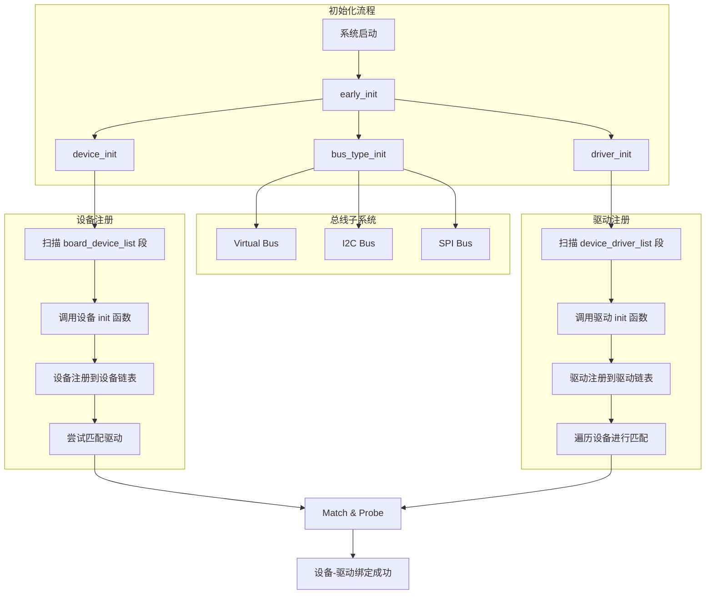
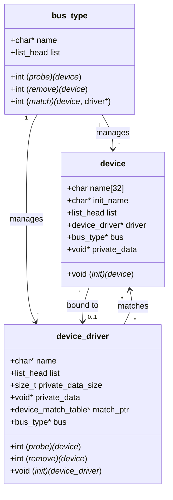
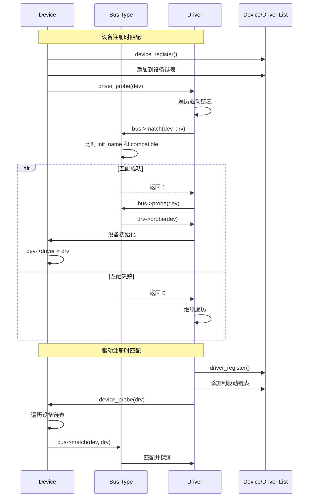
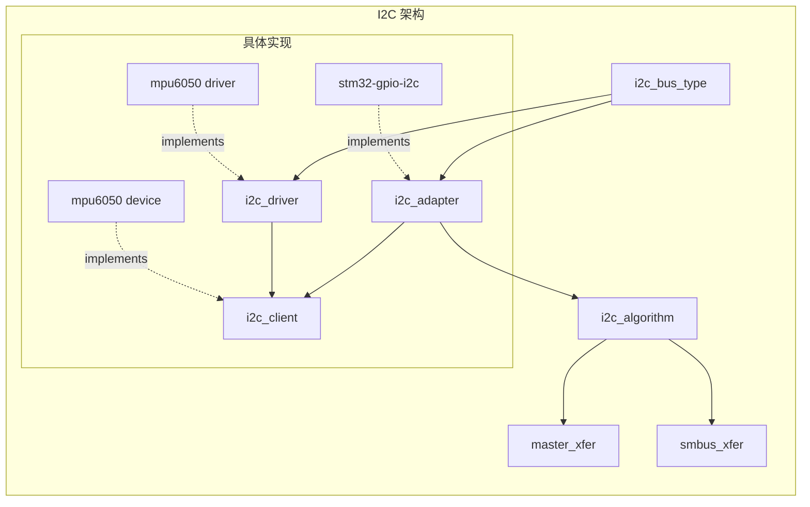
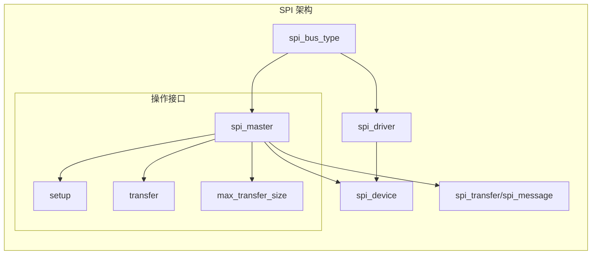
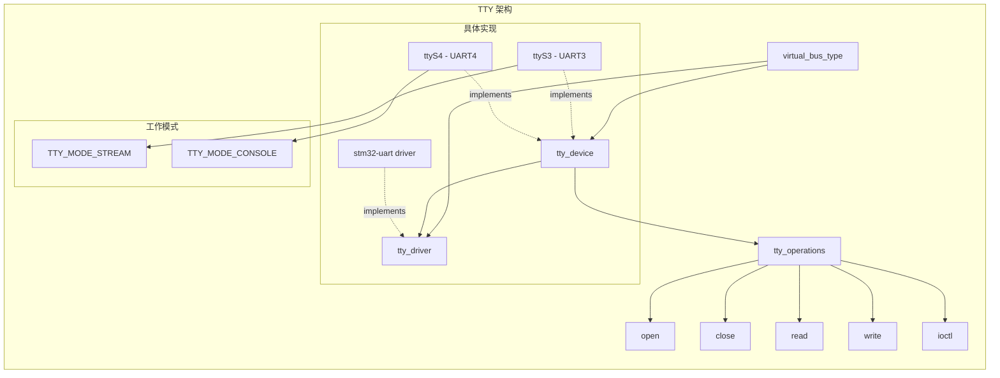
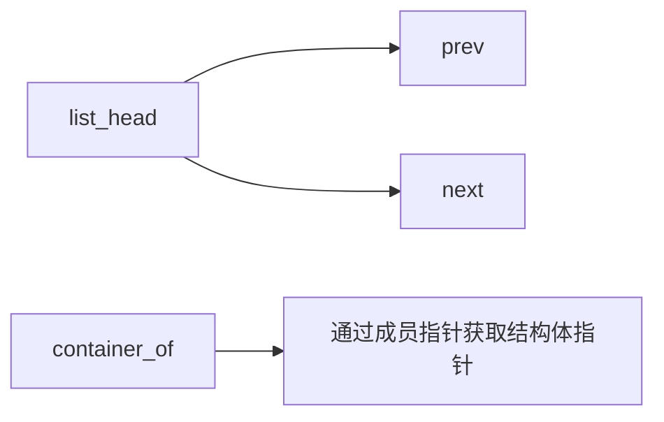
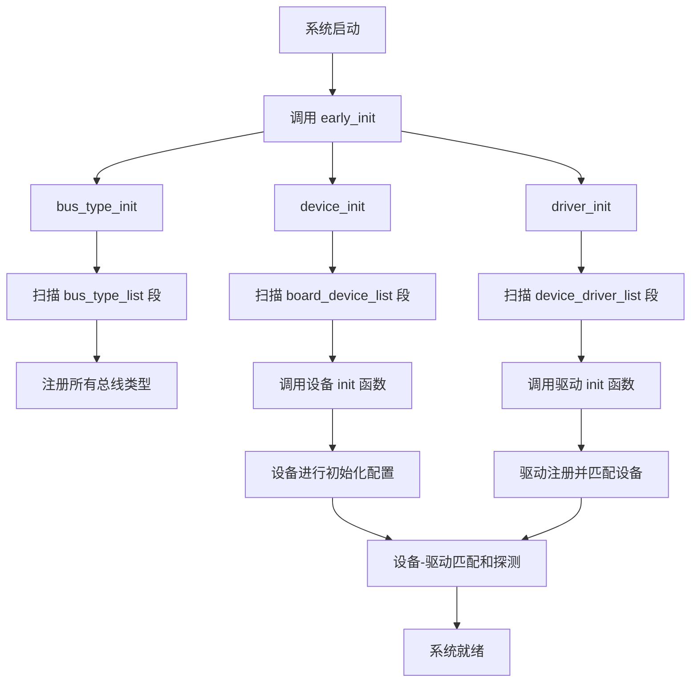

# STM32H7 ART-Pi 驱动架构文档

## 概述

本项目采用了仿照 Linux 内核设计的驱动框架，实现了 **Bus-Device-Driver** 模型，为 STM32H7 平台提供了一个灵活、可扩展的设备驱动管理系统。

## 核心架构

### 1. 整体架构图



### 2. Bus-Device-Driver 模型



### 3. 设备匹配流程



### 4. 子系统架构

#### 4.1 I2C 子系统



#### 4.2 SPI 子系统



#### 4.3 TTY/UART 子系统



## 关键特性

### 1. 自动注册机制

使用 GCC 的 `section` 属性实现设备和驱动的自动注册：

```c
// 设备注册宏
#define register_device(__name, __dev)  \
    static struct device *__name##_device \
    __attribute__((used, section("board_device_list"))) = &__dev

// 驱动注册宏
#define register_driver(__name, __drv)  \
    static struct device_driver *__name##_driver \
    __attribute__((used, section("device_driver_list"))) = &__drv

// 总线注册宏
#define register_bus_type(_bus) \
    static struct bus_type __attribute__((used, section("bus_type_list"))) \
    *_##_bus = &_bus
```

### 2. 链表管理

采用 Linux 内核风格的侵入式双向链表：



关键宏：
- `list_add_tail()` - 添加到链表尾部
- `list_for_each_entry()` - 遍历链表
- `container_of()` - 通过成员获取容器结构体

### 3. 设备树风格的匹配表

```c
struct device_match_table {
    const char *compatible;  // 兼容字符串
    uint32_t data;          // 附加数据
};
```

驱动通过 `match_ptr` 指向匹配表，总线负责遍历匹配。

## 初始化流程



## 支持的总线类型

### 1. Virtual Bus（虚拟总线）
- 用于不需要物理总线的设备
- 通过字符串匹配 `compatible` 字段
- 适用于：TTY/UART、GPIO 等

### 2. I2C Bus
- 支持标准 I2C 协议
- 实现了 `i2c_algorithm` 接口
- 支持设备：MPU6050 等传感器

### 3. SPI Bus
- 支持标准 SPI 协议
- 支持消息队列和传输管理
- 可配置片选、速度、模式等

## 实际应用示例

### 板级设备定义（board.c）

```c
// UART 设备
static struct stm32_uart stm32h7_uart4 = {
    .tty = {
        .dev = {
            .init_name = "stm32-uart",
            .name = "ttyS4",
            .init = stm32h7_uart4_init,
        },
        .port_num = 4,
        .mode = TTY_MODE_CONSOLE
    }
};

// I2C 适配器
static struct i2c_adapter stm32_gpio_i2c = {
    .dev = {
        .init_name = "stm32-gpio-i2c",
        .init = stm32_gpio_i2c_preinit,
    }
};

// I2C 设备
static struct mpu6050_device mpu6050 = {
    .dev = {
        .dev = {
            .init = mpu6050_preinit,
            .init_name = "mpu6050-device"
        },
        .adap = &stm32_gpio_i2c,
        .addr = 0x68,
        .name = "mpu6050"
    }
};

// 注册设备
register_device(stm32h7_uart4, stm32h7_uart4.tty.dev);
register_device(stm32_gpio_i2c, stm32_gpio_i2c.dev);
register_device(mpu6050, mpu6050.dev.dev);
```

## 目录结构

```
User/
├── Drivers/
│   ├── Inc/
│   │   ├── bus.h              # 总线类型定义
│   │   ├── common.h           # 通用定义
│   │   ├── init.h             # 初始化宏
│   │   ├── list.h             # 链表实现
│   │   └── device/
│   │       ├── device.h       # 设备结构
│   │       ├── driver.h       # 驱动结构
│   │       ├── i2c/i2c.h     # I2C 子系统
│   │       ├── spi/spi.h     # SPI 子系统
│   │       └── tty/tty.h     # TTY 子系统
│   └── Src/
│       ├── kernel/
│       │   └── kernel.c       # 核心初始化
│       └── drivers/
│           ├── base/          # 基础驱动框架
│           │   ├── bus.c
│           │   ├── device.c
│           │   └── driver.c
│           ├── i2c/           # I2C 驱动实现
│           ├── spi/           # SPI 驱动实现
│           └── tty/           # TTY 驱动实现
├── board.c                    # 板级设备定义
└── App/
    └── shell/                 # Shell 应用
```

## 设计优势

1. **解耦性强**：设备、驱动、总线相互独立
2. **可扩展性好**：添加新设备/驱动无需修改框架代码
3. **自动化管理**：使用 section 属性自动收集和注册
4. **类 Linux 接口**：熟悉 Linux 驱动开发者容易上手
5. **灵活的匹配机制**：支持设备树风格的匹配表
6. **统一的探测流程**：通过总线抽象统一管理

## 与 Linux 内核对比

| 特性 | Linux Kernel | 本项目 |
|------|--------------|--------|
| Bus-Device-Driver 模型 | ✓ | ✓ |
| 设备树 | 完整支持 | 简化版（匹配表） |
| 链表实现 | 侵入式双向链表 | 相同 |
| Kobject/Kref | ✓ | ✗ |
| Sysfs | ✓ | ✗ |
| 热插拔 | ✓ | ✗ |
| 电源管理 | ✓ | ✗ |

## 总结

本项目成功地将 Linux 内核的驱动模型移植到了 STM32H7 裸机/RTOS 环境中，提供了一个轻量级但功能完整的设备驱动管理框架。通过 Bus-Device-Driver 模型，实现了设备和驱动的解耦，使得系统更加模块化和易于维护。
